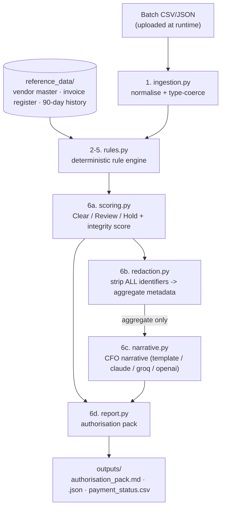

# Pre-Payment Validation Agent

> **Open-source AP control** · Built by **Anand** and **Chirag** · MIT-licensed

A standalone accounts-payable control that validates a **proposed payment batch**
*before* money leaves the building. It checks every payment against your
**vendor master**, **invoice register** and **90-day payment history**, then
produces a controller **authorisation pack** with a CFO-ready narrative.

> **Design principle (auditability):** the LLM *never* validates payments and
> *never* sees transaction-level identifiers. All validation is deterministic
> Python. The model only turns **de-identified aggregate metadata** into a
> narrative paragraph. See [`prepay/redaction.py`](prepay/redaction.py).

---

## Quickstart (5 minutes, no login, no database service)

```bash
# 1. clone, then from the project root:
python -m venv .venv && source .venv/bin/activate    # optional but recommended
pip install -r requirements.txt

# 2. run against a payment batch (CSV or JSON)
python run.py --batch path/to/your_batch.csv
```

That prints a summary + CFO narrative to the terminal and writes an
authorisation pack to `./outputs/`:

| File | Description |
| --- | --- |
| `authorisation_pack.md` | Human-readable pack with sign-off table |
| `authorisation_pack.json` | Machine-readable full result |
| `payment_status.csv` | Per-payment status (Clear / Review / Hold) |

Prefer a UI? Launch the upload interface:

```bash
python app.py       # opens the web UI on http://127.0.0.1:7860
```

Upload a batch CSV/JSON and get a colour-coded status table, flag summary,
integrity score, CFO narrative and a downloadable authorisation pack.

> The default narrative provider is an **offline template** - it needs **no API
> key** and runs completely locally, so the steps above work out of the box.

---

## Setup for a new user (open source)

This is an open-source tool - anyone can clone it and run it in a couple of
minutes. No account, no login, no external services.

**Prerequisites:** Python 3.11-3.13 and `git`. (Docker is optional.)

```bash
# 1. Get the code
git clone <your-repo-url> prepay-validator
cd prepay-validator

# 2. Create an isolated virtual environment
python -m venv .venv
source .venv/bin/activate           # Windows: .venv\Scripts\activate

# 3. Upgrade pip, then install the core dependencies
python -m pip install --upgrade pip
pip install -r requirements.txt

# 4. Add the batch you want to validate
#    (put your CSV/JSON in the data/ folder - see data/README.md)
#    then run:
python run.py --batch data/payment_batch.csv

# ...or launch the web UI instead:
python app.py                       # http://127.0.0.1:7860
```

That's it - the offline narrative template runs with **no API key**, so the
commands above work out of the box. To use a hosted LLM for the narrative, see
[Configurable LLM provider](#configurable-llm-provider) below.

**Optional - run the tests:**

```bash
pip install pytest
pytest -q
```

---

## Interfaces (CLI + web frontend)

The agent ships with **two** ways to run it - no login required for either:

| Interface | Command | Best for |
| --- | --- | --- |
| **CLI** | `python run.py --batch data/payment_batch.csv` | one-command runs, automation, CI |
| **Web frontend** | `python app.py` -> http://127.0.0.1:7860 | drag-and-drop upload, demos, non-technical reviewers |

The web frontend is a lightweight, self-contained UI built on the Python
**standard library** (`http.server`) - it has **no third-party web-framework
dependencies at all**, so `python app.py` just works on any supported Python
(3.9-3.13) with nothing extra to install. Upload a batch -> see a colour-coded
status table, flag summary, integrity score, CFO narrative, and download the
authorisation pack. The heavier React SPA + WebSocket + JWT
frontend from the original build was **intentionally removed** for the
standalone submission (it can live in a personal fork).

---

## Architecture & flow

Everything runs in a single process. One public entry point,
`run_validation()` in [`prepay/pipeline.py`](prepay/pipeline.py), orchestrates
seven stages:



**Stage by stage:**

1. **Ingest** (`ingestion.py`) - read the uploaded batch, map column aliases to
   the canonical schema, coerce numbers/dates, reject malformed batches.
2. **Load reference** (`reference_data.py`) - read the vendor master, invoice
   register and payment history (the source of truth). No database service.
3. **Validate** (`rules.py`) - run all deterministic checks (approval,
   duplicate, terms, vendor, amount, bank routing) as vectorised pandas ops.
4. **Score** (`scoring.py`) - bucket each payment into Clear / Review / Hold and
   compute batch value, flagged value and a value-weighted integrity score.
5. **Redact** (`redaction.py`) - the safety boundary: convert the scored result
   into an aggregate-only metadata payload and assert no identifiers leak.
6. **Narrate** (`narrative.py`) - the (configurable) LLM turns that aggregate
   metadata into a CFO paragraph. It never sees a single payment identifier.
7. **Report** (`report.py`) - render the Markdown/JSON authorisation pack and
   per-payment status CSV into `outputs/`.

> **Why this shape?** Validation is 100% deterministic Python, so results are
> reproducible and auditable. The LLM is isolated to the very last, read-only
> narration step and is fed only de-identified aggregates.

---

## Tech stack & design decisions

| Concern | Choice |
| --- | --- |
| Language | Python 3.11-3.13 |
| Data engine | **pandas** (vectorised rules; `pandas>=2.2.2` for prebuilt wheels) |
| Web UI | **Python standard library** (`http.server`) - zero web-framework deps |
| LLM (narrative only) | pluggable: offline template (default), Anthropic Claude, Groq, OpenAI |
| Storage | plain CSV files - **no SQLite/Postgres service to run** |
| Orchestration | a plain, typed Python pipeline (`pipeline.py`) |

### Why LangGraph is *not* used

**LangGraph is intentionally not part of this project.** The original brief
*suggested* it as a possible stack, but after building the flow it is clearly
not needed here. Reasons:

1. **The flow is linear and deterministic, not agentic.** Validation is a fixed
   seven-stage pipeline (ingest -> validate -> score -> redact -> narrate ->
   report). There is **no agentic branching, no tool-calling loop, no
   LLM-driven control flow, and no shared mutable graph state** for a graph
   runtime to manage. LangGraph solves problems this project does not have.
2. **No heavy dependencies by design.** The reviewer's publishing bar is
   "clone -> one command -> works in 5 minutes, no login, no separate services."
   LangGraph (and its LangChain transitive dependencies) would add a large
   install footprint, a slower cold start, and version-pinning friction - all
   cost, no behavioural benefit. The core tool depends only on **pandas**; the
   web UI adds nothing (standard library only) and the LLM provider SDKs are
   optional extras.
3. **Auditability.** Because orchestration is plain, typed Python
   (`prepay/pipeline.py`), every step is trivially readable, unit-testable and
   reproducible - which matters for a financial control where the LLM is
   deliberately kept out of the validation path.
4. **Determinism over a runtime.** A payment either violates a rule or it does
   not; wrapping that in a graph executor would obscure the logic without making
   it more correct.

**Bottom line:** a graph orchestration layer would be an unnecessary heavy
dependency for a pipeline that is inherently linear and deterministic, so it is
intentionally omitted.

If a LangGraph implementation is ever *required* (e.g. to satisfy a stack
mandate), it is a clean drop-in wrapper: each stage above becomes a node and
`run_validation` becomes the compiled graph, reusing the deterministic rule
functions unchanged - no core logic would need to change.

---

## The six validation steps

| # | Step | What it does |
| --- | --- | --- |
| 1 | **Batch ingestion** | Loads the proposed batch (CSV/JSON), normalises column names and coerces types. |
| 2 | **Approval status check** | Flags any payment not `Approved` or with a blank approver. |
| 3 | **Duplicate payment check** | Flags an invoice already paid in the last 90 days, or the same vendor + amount paid within 30 days. |
| 4 | **Payment-terms compliance** | Detects overdue payments and surfaces available / missed early-payment discounts. |
| 5 | **Vendor & amount validation** | Confirms the vendor is in the master and active, the invoice is registered, the amount is within 0.5% of the approved amount, and bank routing matches. |
| 6 | **Authorisation summary** | Assigns each payment `Clear` / `Review Required` / `Hold`, computes batch value, flagged value and an integrity score, and generates the CFO narrative + sign-off table. |

---

## Setting up the source of truth (reference data)

The agent validates every batch against **three CSV files** that live in the
[`reference_data/`](reference_data/) folder. These are your **source of truth** -
replace the shipped sample files with your own organisation's data (keep the
same file names and column headers).

```
prepay-validator/
└─ reference_data/
   ├─ vendor_master.csv       # who you're allowed to pay
   ├─ invoice_register.csv    # approved invoices + approved amounts
   └─ payment_history.csv     # what you've already paid (duplicate detection)
```

**1. `vendor_master.csv`** - the approved vendor list.

| Column | Required | Description |
| --- | --- | --- |
| `vendor_id` | yes | Unique vendor code (matched against the batch). |
| `vendor_name` | yes | Display name. |
| `gl_account_code` | optional | GL account for reporting. |
| `approved_bank_routing` | recommended | Expected bank routing; drives the bank-routing-mismatch check. |
| `payment_terms` | recommended | e.g. `NET30`; drives the terms/overdue check. |
| `is_active` | recommended | `True`/`False`; inactive vendors are held. |

**2. `invoice_register.csv`** - the approved invoices and their approved amounts.

| Column | Required | Description |
| --- | --- | --- |
| `payment_id` | yes | Links a batch row to its approved invoice. |
| `invoice_number` | yes | Approved invoice number. |
| `approved_invoice_amount` | yes | Approved amount; batch amounts beyond 0.5% are flagged. |

**3. `payment_history.csv`** - prior payments, used for duplicate detection.

| Column | Required | Description |
| --- | --- | --- |
| `invoice_number` | yes | Detects an invoice already paid within 90 days. |
| `vendor_id` | yes | Used for same-vendor + same-amount duplicate detection. |
| `vendor_name` | optional | For readability. |
| `amount` | yes | Prior paid amount. |
| `payment_date` | yes | Date paid (`YYYY-MM-DD`); the 90/30-day windows are measured from today. |
| `status` | optional | Prior payment status. |
| `bank_routing_used` | optional | Routing used previously. |

> **Tip:** point at a different reference folder without moving files using
> `--reference-dir /path/to/folder` or the `PREPAY_REFERENCE_DIR` env var.

---

## The payment batch you upload (the file to validate)

### Where to put it

Drop the batch you want to validate into the **`data/`** folder, then point
`--batch` at it:

```
prepay-validator/
└─ data/
   └─ payment_batch.csv      # <-- your test/production batch goes here
```

```bash
python run.py --batch data/payment_batch.csv     # CLI
# or
python app.py                                     # web UI: upload the file in the browser
```

The folder is only a convention - `--batch` accepts **any path** (`CSV` or
`JSON`), and the web UI lets you upload from anywhere. Do **not** put the
batch in `reference_data/`; that folder is only for the three source-of-truth
files.

### Required columns

Every batch row **must** contain these four columns:

| Column | Description |
| --- | --- |
| `payment_id` | Unique ID for the payment; links to the invoice register. |
| `vendor_id` | Vendor code; matched against `vendor_master.csv`. |
| `invoice_number` | Invoice being paid; matched against the invoice register. |
| `payment_amount` *(or `amount`)* | The amount you propose to pay. |

### Recommended columns (needed for full coverage)

Without these, the related check is simply skipped for that row:

| Column | Enables |
| --- | --- |
| `vendor_name` | Readable output. |
| `payment_date` | Duplicate windows + terms/overdue timing. |
| `payment_method` | Payment-method-vs-preferred check (ACH/WIRE/CHECK). |
| `invoice_due_date` *(alias `due_date`)* | Overdue-payment check. |
| `approval_status` | Approval check (must be `Approved`). |
| `approver_name` | Approval check (blank approver is flagged). |
| `early_pay_discount`, `early_pay_deadline` | Early-payment-discount detection. |
| `invoice_amount` | Optional. Only used as a fallback for the amount check when the payment is not found in `invoice_register.csv` (the register is the authority). |

### Example header row

```csv
payment_id,vendor_id,vendor_name,invoice_number,payment_amount,payment_method,approval_status,approver_name,payment_date,due_date,early_pay_discount,early_pay_deadline
```

Common aliases are auto-mapped, so slightly different headers still work (e.g.
`approver_name` -> `authorizer`, `payment_amount` -> `amount`,
`due_date` -> `invoice_due_date`). See [`prepay/schema.py`](prepay/schema.py)
for the full alias list.

### Example

**Input (batch CSV):**

```csv
payment_id,vendor_id,vendor_name,invoice_number,payment_amount,payment_method,approval_status,approver_name,payment_date,due_date
PAY-101,V001,Acme Logistics Ltd,INV-90001,36100.00,ACH,Approved,CFO-JAMES-WALKER,2026-06-07,2026-07-02
PAY-102,V003,Nexus Software Corp,INV-88219,7200.00,ACH,Approved,DIR-SARA-PATEL,2026-06-08,2026-07-03
PAY-103,V999,Ghost Vendor Ltd,INV-90024,5500.00,ACH,Pending,,2026-06-09,2026-07-04
```

(In this example PAY-102 trips the duplicate check against the payment history,
and PAY-103 is both an unknown vendor and unapproved. The approved amounts are
looked up from `invoice_register.csv`, not from the batch.)

**Output (excerpt of `authorisation_pack.md`):**

```markdown
# Payment Run Authorisation Pack

**Decision:** HOLD - controller review required before release
**Batch integrity score:** 61.9/100

## Controller narrative
This payment run contains 3 payments totalling $48,900 ...

## Payment listing
| Payment | Vendor | Invoice | Amount | Status | Flags |
| --- | --- | --- | --- | --- | --- |
| PAY-501 | Acme Industrial Supplies | INV-90001 | $36,700.00 | \U0001F7E2 Clear | - |
| PAY-502 | Nexus Software Corp | INV-88219 | $7,200.00 | \U0001F534 Hold | Duplicate payment |
| PAY-503 | Ghost Vendor Ltd | INV-77777 | $5,000.00 | \U0001F534 Hold | Vendor not in master; Unapproved payment; Unregistered invoice |
```

(`PAY-502` reuses invoice `INV-88219`, which is already in the payment history,
so it is caught as a duplicate; `PAY-503` fails vendor, approval and invoice
checks.)

---

## Configurable LLM provider

The narrative provider is selected with the `LLM_PROVIDER` environment variable
(or `--provider` on the CLI):

| `LLM_PROVIDER` | Requirement |
| --- | --- |
| `template` (default) | none - fully offline & deterministic |
| `anthropic` | `ANTHROPIC_API_KEY` + `pip install anthropic` |
| `groq` | `GROQ_API_KEY` + `pip install groq` |
| `openai` | `OPENAI_API_KEY` + `pip install openai` |

> **What the LLM does (and does not do):** the model **never** validates
> payments and **never** sees transaction-level identifiers. All Clear / Review
> / Hold decisions come from the deterministic rule engine. The provider only
> rewrites the already-computed, **redacted aggregate** summary into a CFO
> narrative paragraph. A hard safety gate (`assert_redacted`) raises an error if
> any identifier ever tried to reach a model.

### Provider fallback chain (Anthropic + Groq, template as fallback)

`LLM_PROVIDER` accepts either a single provider **or an ordered, comma-separated
chain** that is tried left-to-right until one succeeds. The offline `template`
is always the final safety net when `LLM_FALLBACK_TO_TEMPLATE=true`, so you
never need to append it explicitly.

```bash
# Try Anthropic first; if it fails, try Groq; if that fails, use the template.
LLM_PROVIDER=anthropic,groq
```

### One-time install of the provider SDKs

```bash
source .venv/bin/activate
pip install -r requirements-llm.txt      # installs anthropic + groq + openai
# (or install only what you use:  pip install anthropic groq)
```

### Integrating Anthropic (Claude)

1. Create an API key at <https://console.anthropic.com> -> **API Keys**
   (looks like `sk-ant-...`).
2. Add these lines to your **`.env`** file (copy `.env.example` to `.env` first):
   ```
   ANTHROPIC_API_KEY=sk-ant-your-real-key
   ANTHROPIC_MODEL=claude-3-5-sonnet-latest
   ```
3. Make Anthropic the (primary) provider:
   ```
   LLM_PROVIDER=anthropic          # or  anthropic,groq  for a chain
   ```

### Integrating Groq (LLaMA)

1. Create a free API key at <https://console.groq.com> -> **API Keys**
   (looks like `gsk_...`).
2. Add these lines to your **`.env`** file:
   ```
   GROQ_API_KEY=gsk_your-real-key
   GROQ_MODEL=llama-3.3-70b-versatile
   ```
3. Make Groq the (primary or fallback) provider:
   ```
   LLM_PROVIDER=groq               # or  anthropic,groq  for a chain
   ```

### Putting it together (recommended `.env`)

```
LLM_PROVIDER=anthropic,groq
LLM_FALLBACK_TO_TEMPLATE=true

ANTHROPIC_API_KEY=sk-ant-your-real-key
ANTHROPIC_MODEL=claude-3-5-sonnet-latest

GROQ_API_KEY=gsk_your-real-key
GROQ_MODEL=llama-3.3-70b-versatile
```

Then run as usual:

```bash
python run.py --batch your_batch.csv
# override the chain for a single run:
python run.py --batch your_batch.csv --provider groq
```

**How to tell which provider was used:** the CFO narrative wording changes when
an LLM answers. If every configured LLM is unreachable, the tool prints the
deterministic template paragraph with a trailing note such as
`[note: LLM provider(s) unavailable (anthropic: AuthenticationError; groq: ...); used offline template.]`
so you can see exactly which provider failed and why.

> **Never commit secrets.** Put real keys only in `.env` (git-ignored), never in
> `.env.example` (which is committed). If a key is ever exposed, rotate it in the
> provider console.

---

## Running the tests

```bash
pip install pytest
pytest -q
```

The suite covers every rule, the scoring buckets and the redaction safety gate.

---

## Optional: Docker

Docker is **not** required. If you prefer it:

```bash
docker compose up --build       # web UI on http://127.0.0.1:7860
# or the CLI:
docker run --rm -v "$(pwd):/app" prepay-validator \
    python run.py --batch data/your_batch.csv
```

---

## Project layout

```
prepay-validator/
├─ run.py                  # CLI entry point (one command)
├─ app.py                  # web upload interface (stdlib http.server, no deps)
├─ requirements.txt        # core deps (pandas>=2.2.2 ships wheels for py3.12)
├─ requirements-llm.txt    # optional provider SDKs (claude/groq/openai)
├─ .env.example            # copy to .env to configure the LLM provider
├─ Dockerfile              # optional container build
├─ docker-compose.yml      # optional convenience wrapper
├─ prepay/
│  ├─ config.py            # all tunables + env overrides
│  ├─ schema.py            # canonical columns, aliases, violation taxonomy
│  ├─ ingestion.py         # step 1
│  ├─ reference_data.py    # source-of-truth loaders
│  ├─ rules.py             # steps 2-5 (deterministic engine)
│  ├─ scoring.py           # step 6 scoring + status buckets
│  ├─ redaction.py         # identifier-redaction safety layer
│  ├─ narrative.py         # configurable CFO narrative (template/claude/groq/openai)
│  ├─ report.py            # authorisation pack (md/json/csv)
│  └─ pipeline.py          # orchestration (run_validation)
├─ reference_data/         # vendor master, invoice register, payment history
├─ data/                   # drop your payment batch here (git-ignored)
├─ outputs/                # generated authorisation packs
└─ tests/                  # pytest suite
```

## Troubleshooting

**`pandas` fails to build / Cython / NumPy compile error.** Use the pinned
`pandas>=2.2.2` (in `requirements.txt`), which ships prebuilt wheels for
Python 3.11-3.13 and avoids compiling from source. Upgrade pip first:
`pip install --upgrade pip`.

**`python app.py` -> anything mentioning `gradio`, `HfFolder`,
`huggingface_hub`, `TypeError: argument of type 'bool' is not iterable`, or
`ValueError: ... set share=True`.** These come from an **older build** that used
Gradio for the web UI. The current build has **removed Gradio entirely** - the
web UI now uses only the Python standard library, so it has no such
dependencies. If you see any of these, you are running an outdated `app.py`:
re-download the latest project (or replace `app.py` and `requirements.txt`),
then simply run `python app.py`. No `pip install` of a UI framework is needed,
and any previously installed `gradio`/`huggingface_hub` packages can be ignored.

**Python version.** Use Python 3.11-3.13 for the smoothest install. The CLI
also runs on 3.9/3.10, but the **web UI requires Python 3.10+** (see above).

**Every payment is flagged `UNAPPROVED_PAYMENT`.** This almost always means the
batch is missing (or mis-naming) the approval columns. Check that your batch
has an **`approval_status`** column whose value is `Approved` (also accepted:
`Approve`, `Authorised`, `Authorized`) **and** a non-blank approver column
(`approver_name` / `approved_by` / `authorizer`). If either is absent or blank,
the control correctly holds the payment. Open `outputs/authorisation_pack.md`
(the `reason` text) to see whether it was the status value or a blank approver.

---

## Contributing

Contributions are welcome. A good workflow:

1. Fork and clone, then follow [Setup for a new user](#setup-for-a-new-user-open-source).
2. Add or adjust a rule in `prepay/rules.py` and a matching test in
   `tests/test_rules.py`.
3. Run `pytest -q` and make sure everything passes.
4. Open a pull request describing the control you added or changed.

All validation logic is deterministic and unit-tested, so new rules should come
with tests that assert both the positive (flagged) and negative (clean) cases.

---

## Authors

Built and maintained by:

- **Anand**
- **Chirag**

---

## License

Released under the **MIT License** - see [`LICENSE`](LICENSE). You are free to
use, modify and distribute this tool, including commercially, provided the
copyright and licence notice are retained.
